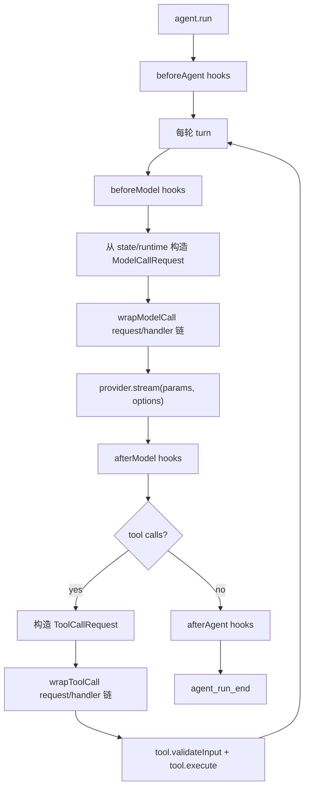

# Middleware 中间件设计文档

> 版本：v0.3.0 · 日期：2026-06-06

## 1. 设计目标

中间件是 Agent Loop 的策略扩展机制，用来把上下文整理、权限控制、重试、限流、缓存、可观测性等横切逻辑从核心循环中拆出来。

这版设计重新划清 `hook` 与 `wrap` 的职责：

- `hook` 是生命周期扩展点，处理 agent run / model turn 的阶段性状态读写。
- `wrap` 是调用拦截器，处理一次真实模型调用或一次真实工具调用的请求形态、执行次数、兜底、重试与结果包装。
- 需要改变“最终传给模型 API 的入参”或“最终传给工具实现的入参”时，优先使用 `wrapModelCall` / `wrapToolCall`，而不是在 hook 里修改全局 runtime 字段。

## 2. Hook 与 Wrap

### 2.1 Hook：生命周期状态节点

Hook 在 Agent Loop 的固定阶段顺序运行，输入是 `RunContext`，职责是读写持久 `AgentState`、更新 run/turn 级统计、注入或整理消息、做阶段性校验。

适合放在 hook 的逻辑：

- `beforeAgent`：初始化中间件 state、加载 run-level 配置。
- `beforeModel`：整理 `state.messages`、注入 agent 内部提醒消息、更新每轮计数。
- `afterModel`：观察 `loopState.lastResponse`、记录模型输出统计、检查 tool call 一致性。
- `afterAgent`：清理临时资源、收尾统计；具有 finally 语义。

Hook 不负责包住一次调用，也不适合表达“调用内层逻辑多次”。

### 2.2 Wrap：调用拦截器

Wrap 直接包住一次模型调用或工具调用，签名是 `request + handler(request)`：

- `request` 是本次调用的真实请求对象。
- `handler` 表示继续向内执行：进入内层 middleware，最终到 provider API 或 tool implementation。
- wrap 可以修改 request 后调用 handler。
- wrap 可以不调用 handler，直接返回替代结果。
- wrap 可以多次调用 handler，实现 retry、fallback、缓存击穿重试。
- wrap 可以捕获 handler 抛出的错误并包装结果。

适合放在 wrap 的逻辑：

- `wrapModelCall`：动态 system、上下文裁剪、工具集合改写、model params 改写、模型调用重试、fallback provider、响应缓存。
- `wrapToolCall`：工具鉴权、工具参数修正、动态 tool 实例、工具重试、超时、熔断、错误转义、结果截断。

## 3. 公共接口

```ts
interface AgentMiddleware {
  name: string

  /** 中间件声明的工具，自动合并进 Agent 可用工具集 */
  tools?: Tool[]

  /** 默认 AgentState 顶层扩展字段，run 开始时合并，不覆盖调用方已有字段 */
  state?: Record<string, unknown>

  // Hook：生命周期状态读写
  beforeAgent?(ctx: RunContext): Awaitable<void>
  afterAgent?(ctx: RunContext): Awaitable<void>
  beforeModel?(ctx: RunContext): Awaitable<void>
  afterModel?(ctx: RunContext): Awaitable<void>

  // Wrap：真实调用拦截
  wrapModelCall?(request: ModelCallRequest, handler: ModelCallHandler): Awaitable<StreamResult>

  wrapToolCall?(request: ToolCallRequest, handler: ToolCallHandler): Awaitable<ToolOutput>
}
```

`createMiddleware` 支持对象字面量形式，并对默认 `state` 做深克隆，避免多个中间件实例共享同一份默认状态。

## 4. Context 与 Request

### 4.1 RunContext

`RunContext` 是 hook 和 wrap 都能访问的 run 级视图。

```ts
interface RunContext {
  /** 完整会话状态；中间件直接修改会持久化 */
  state: AgentState

  /** 调用方传入的只读环境/意图信息，例如 cwd、用户配置 */
  readonly props: Readonly<Record<string, unknown>>

  /** 运行期能力与配置，例如 provider、system、tools、signal、事件发射 */
  runtime: AgentRuntime

  /** Agent Loop 内部控制状态，例如 turnIndex、lastResponse、pendingToolCalls */
  loopState: AgentLoopState
}
```

`state` 是持久化真相；`props` 是只读输入；`runtime.signal` 只表示取消控制，不进入持久状态。

### 4.2 ModelCallRequest

`ModelCallRequest` 表示本次将要调用 provider 的真实入参。

```ts
interface ModelCallRequest {
  readonly context: RunContext
  provider: LLMProvider
  params: ChatParams
  options: CallOptions
}

type ModelCallHandler = (request: ModelCallRequest) => Promise<StreamResult>
```

核心 loop 会在 `beforeModel` 之后，从当前 `state.messages`、`runtime.system`、`runtime.tools` 构造 `params`。`wrapModelCall` 再围绕这个 request 做最终改写。

示例：

```ts
const dynamicSystemPrompt = createMiddleware({
  name: 'dynamic-system-prompt',
  async wrapModelCall(request, handler) {
    return handler({
      ...request,
      params: {
        ...request.params,
        system: appendSection(request.params.system, buildPrompt(request.context)),
      },
    })
  },
})
```

### 4.3 ToolCallRequest

`ToolCallRequest` 表示本次将要执行 tool implementation 的真实入参。

```ts
interface ToolCallRequest {
  readonly context: RunContext
  toolCallId: string
  toolName: string
  toolInput: Record<string, unknown>
  tool?: Tool
}

type ToolCallHandler = (request: ToolCallRequest) => Promise<ToolOutput>
```

核心 handler 会用 `request.tool ?? toolMap.get(request.toolName)` 找到工具，再对 `request.toolInput` 做校验并执行。`wrapToolCall` 可以改写 `toolInput`、替换 `tool`、拒绝执行或重试。

示例：

```ts
const permissionGuard = createMiddleware({
  name: 'permission-guard',
  async wrapToolCall(request, handler) {
    if (isDangerous(request.toolName, request.toolInput)) {
      const approved = await askUserApproval(request.toolName, request.toolInput)
      if (!approved) return { content: '用户拒绝了此操作', isError: true }
    }
    return handler(request)
  },
})
```

### 4.4 ToolCallContext

工具实现仍然接收 `ToolCallContext` / `ToolRunContext`，它由最终的 `ToolCallRequest` 派生：

```ts
interface ToolCallContext extends RunContext {
  readonly toolCallId: string
  readonly toolName: string
  readonly toolInput: Record<string, unknown>
}
```

因此 wrapper 改写后的 `toolInput` 会成为工具实现看到的真实输入。

## 5. 执行流程



顺序规则：

- hook 按中间件注册顺序执行。
- wrap 从后往前组合，注册数组里的第一个中间件位于最外层。
- `beforeModel` 每轮只执行一次；如果某个 `wrapModelCall` 内部重试，重试只重复 provider 调用，不重复生命周期 hook。
- `afterAgent` 吞掉自身异常，避免遮盖 loop 主错误。

## 6. 中间件状态

`AgentState` 是调用方持有并传入 `run()` 的会话状态：

```ts
interface AgentState {
  messages: AgentMessage[]
  usage: Usage
  [key: string]: unknown
}
```

中间件可通过 `state` 声明默认顶层扩展字段：

```ts
const counter = createMiddleware({
  name: 'counter',
  state: { modelCalls: 0 },
  afterModel(ctx) {
    ctx.state.modelCalls = (ctx.state.modelCalls as number) + 1
  },
})
```

约束：

- 默认 `state` 只在缺失 key 时合并，不覆盖调用方已有状态。
- 中间件写入 `AgentState` 的内容应保持可 JSON 序列化，便于 checkpoint/resume。
- 不再引入单独 `store` 或 `callMessages` 兼容层；需要改变模型请求时使用 `ModelCallRequest.params`。

## 7. 典型模式

### 7.1 上下文压缩

如果压缩需要改变持久消息状态，在 `beforeModel` 中标记或整理 `ctx.state.messages`。如果只想改变本次发送给 provider 的消息窗口，在 `wrapModelCall` 中改写 `request.params.messages`。

```ts
const contextWindow = createMiddleware({
  name: 'context-window',
  async wrapModelCall(request, handler) {
    return handler({
      ...request,
      params: {
        ...request.params,
        messages: trimMessages(request.params.messages),
      },
    })
  },
})
```

### 7.2 模型重试

```ts
const retry = createMiddleware({
  name: 'retry',
  async wrapModelCall(request, handler) {
    for (let attempt = 0; attempt < 3; attempt++) {
      try {
        return await handler(request)
      } catch (err) {
        if (!isRetryable(err) || attempt === 2) throw err
        await delay(1000 * 2 ** attempt)
      }
    }
    throw new Error('unreachable')
  },
})
```

### 7.3 工具参数修正

```ts
const normalizePathInput = createMiddleware({
  name: 'normalize-path-input',
  async wrapToolCall(request, handler) {
    if (request.toolName !== 'read_file') return handler(request)
    return handler({
      ...request,
      toolInput: {
        ...request.toolInput,
        path: normalizePath(String(request.toolInput.path)),
      },
    })
  },
})
```

## 8. 设计判断规则

| 问题                                                          | 入口                         |
| ------------------------------------------------------------- | ---------------------------- |
| 要在 run 开始或结束时初始化/清理状态？                        | `beforeAgent` / `afterAgent` |
| 要在每轮模型前后维护持久状态？                                | `beforeModel` / `afterModel` |
| 要改最终发给 provider 的 messages/system/tools/model params？ | `wrapModelCall`              |
| 要决定模型调用是否发生、发生几次、使用哪个 provider？         | `wrapModelCall`              |
| 要改最终发给工具实现的 toolInput 或 tool 实例？               | `wrapToolCall`               |
| 要拒绝工具执行、重试工具、截断工具结果？                      | `wrapToolCall`               |
| 要把工具结果写入持久 state？                                  | 工具实现或 `wrapToolCall`    |

核心原则：hook 管阶段和状态；wrap 管调用本身。
