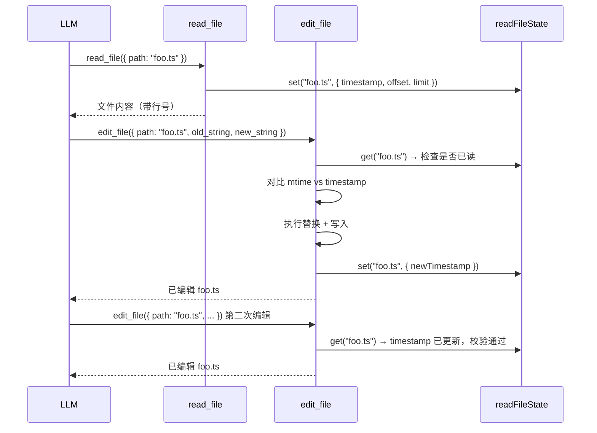

# Edit File Tool 设计

## 背景

当前 `edit_file` 工具实现为最小可用版本——仅做精确字符串匹配替换 + 唯一性校验。参考 Claude Code 的 `FileEditTool` 设计，本文档规划 `edit_file` 的完整升级方案，重点解决**读写一致性**、**容错能力**和**使用体验**三大问题。

---

## 设计目标

1. **一致性**：通过读写状态联动，防止并发/外部修改导致的数据丢失
2. **容错**：引号标准化、尾随空行清理、模糊匹配建议，降低 LLM 匹配失败率
3. **灵活性**：支持 `replace_all` 批量替换、`old_string = ""` 创建/追加语义
4. **安全**：文件大小预检、路径规范化、危险路径拦截

---

## 参数设计

```typescript
const inputSchema = z.object({
  /** 文件路径（相对 cwd 或绝对路径，支持 ~ 展开） */
  path: z.string().min(1),
  /** 要替换的精确文本。空字符串有特殊语义：创建新文件或向空文件追加 */
  old_string: z.string(),
  /** 替换后的文本 */
  new_string: z.string(),
  /** 是否替换所有匹配项（默认 false，要求唯一匹配） */
  replace_all: z.boolean().optional().default(false),
})
```

### `old_string` 为空字符串的语义

| 文件状态     | 行为                           |
| ------------ | ------------------------------ |
| 不存在       | 创建文件，内容为 `new_string`  |
| 存在但为空   | 写入 `new_string`              |
| 存在且有内容 | **报错**：文件已存在，拒绝覆盖 |

### 与 `write_file` 工具的关系

保留独立的 `write_file` 工具用于创建新文件。`edit_file` 的 `old_string = ""` 创建语义作为辅助，当 LLM 在编辑流程中需要创建文件时无需切换工具。两者职责：

- `write_file`：显式的创建新文件工具
- `edit_file`：精确编辑工具，附带创建能力

---

## 核心机制

### 1. 读前置校验（Must Read Before Edit）

**原则**：禁止对未读取过的文件执行编辑。

编辑工具通过检查 `readFileState` 确认目标文件是否已被 `read_file` 读取过。这确保 LLM 在编辑前已理解文件上下文，避免盲改。

```typescript
// 从 metadata 中获取文件读取状态
const readFileState = getReadFileState(ctx.store)
if (readFileState && !readFileState.has(resolvedPath)) {
  // old_string 为空（创建新文件）时免检
  if (input.old_string !== '') {
    return {
      content: '文件尚未被读取。请先使用 read_file 读取文件内容，再进行编辑。',
      isError: true,
    }
  }
}
```

**豁免条件**：

- `old_string = ""` 且文件不存在（创建新文件场景）
- 第一轮对话时若无 readFileState（向后兼容）

### 2. 文件修改时间戳校验

**原则**：如果文件在 read 之后被外部修改过，拒绝编辑并要求重新读取。

```typescript
const cached = readFileState.get(resolvedPath)
if (cached) {
  const currentMtime = (await stat(resolvedPath)).mtimeMs
  if (Math.floor(currentMtime) > cached.timestamp) {
    return {
      content: '文件自上次读取后已被外部修改。请重新读取后再编辑。',
      isError: true,
    }
  }
}
```

这防止了以下场景中的数据丢失：

- 用户在编辑器中手动修改了文件
- linter/formatter 在后台修改了文件
- 其他并发 agent 修改了同一文件

### 3. 编辑后更新 readFileState

写入成功后，必须立即更新 `readFileState`，否则后续编辑会被时间戳校验拒绝：

```typescript
// 写入成功后更新缓存
if (readFileState) {
  const newMtime = (await stat(resolvedPath)).mtimeMs
  readFileState.set(resolvedPath, {
    timestamp: Math.floor(newMtime),
    offset: undefined, // 编辑后视为全文已知
    limit: undefined,
  })
}
```

### 4. 精确匹配与容错

#### 4.1 基础精确匹配

核心仍然是 `String.prototype.indexOf` 精确查找。匹配次数决定行为：

| 匹配次数 | `replace_all = false`    | `replace_all = true` |
| -------- | ------------------------ | -------------------- |
| 0        | 报错 + 诊断              | 报错 + 诊断          |
| 1        | 执行替换                 | 执行替换             |
| ≥ 2      | 报错，要求提供更多上下文 | 执行全部替换         |

#### 4.2 引号标准化（Phase 2）

LLM 输出的直引号（`'` `"`）可能需匹配文件中的弯引号（`'` `'` `"` `"`）。使用 `findActualString` 做标准化匹配：

```typescript
function findActualString(fileContent: string, searchString: string): string | null {
  // 精确匹配优先
  if (fileContent.includes(searchString)) {
    return searchString
  }
  // 标准化引号后重试
  const normalizedSearch = normalizeQuotes(searchString)
  const normalizedFile = normalizeQuotes(fileContent)
  const idx = normalizedFile.indexOf(normalizedSearch)
  if (idx !== -1) {
    return fileContent.substring(idx, idx + searchString.length)
  }
  return null
}
```

当通过标准化匹配成功时，`new_string` 也需要保持原文件的引号风格（`preserveQuoteStyle`）。

#### 4.3 删除时清理尾随换行

当 `new_string = ""`（删除模式）时，如果 `old_string` 不以换行结尾但文件中其后紧跟换行，则连同换行一起删除，避免留下空行：

```typescript
if (newString === '') {
  const stripTrailingNewline = !oldString.endsWith('\n') && fileContent.includes(oldString + '\n')
  if (stripTrailingNewline) {
    fileContent = fileContent.replace(oldString + '\n', '')
  } else {
    fileContent = fileContent.replace(oldString, '')
  }
}
```

### 5. 匹配失败诊断

当 `old_string` 无法匹配时，提供有用的诊断信息帮助 LLM 修正：

```typescript
function buildMismatchDiagnostic(fileContent: string, oldString: string): string {
  const lines = oldString.split('\n')
  // 尝试找到部分匹配（前几行能匹配但后面断了）
  for (let i = lines.length - 1; i >= 1; i--) {
    const partial = lines.slice(0, i).join('\n')
    if (fileContent.includes(partial)) {
      return `前 ${i} 行可以匹配，但第 ${i + 1} 行开始不匹配。请检查缩进或内容差异。`
    }
  }
  return '未找到任何部分匹配。请确认文件路径和内容是否正确。'
}
```

### 6. 文件大小预检

```typescript
const MAX_EDIT_FILE_SIZE = 10 * 1024 * 1024 // 10 MB

const stats = await stat(resolvedPath)
if (stats.size > MAX_EDIT_FILE_SIZE) {
  return {
    content: `文件过大 (${formatSize(stats.size)})，超出编辑限制 (${formatSize(MAX_EDIT_FILE_SIZE)})。`,
    isError: true,
  }
}
```

---

## Prompt 设计

```typescript
getPrompt(ctx: ToolPromptContext): string {
  return `通过精确字符串匹配编辑文件内容。

使用说明：
- 必须先使用 read_file 读取文件，再进行编辑
- path 参数支持绝对路径或相对于工作目录（${ctx.cwd}）的相对路径
- old_string 必须与文件中的内容完全一致（包括缩进、空格、换行）
- 注意 read_file 返回的行号前缀不是文件内容的一部分，不要包含在 old_string 中
- old_string 不唯一时会报错。请提供更多上下文行使其唯一，或使用 replace_all 替换所有出现
- 使用最小的 old_string 足以唯一定位即可（通常 2-4 行上下文够了）
- old_string 为空字符串时表示创建新文件（文件不得已存在）
- replace_all 适用于变量重命名等需要全局替换的场景
- 优先编辑现有文件，避免不必要地创建新文件`
}
```

---

## validateInput 实现

```typescript
validateInput(input) {
  const rawPath = expandPath(input.path)

  // old_string 和 new_string 相同则无意义
  if (input.old_string === input.new_string) {
    return { valid: false, error: 'old_string 与 new_string 完全相同，无需编辑。' }
  }

  // 危险设备路径拦截
  if (BLOCKED_DEVICE_PATHS.has(rawPath)) {
    return { valid: false, error: `无法编辑设备文件 ${input.path}。` }
  }

  return { valid: true }
}
```

---

## 执行流程

```
输入校验 (validateInput)
    ↓
路径解析 (expandPath + resolve)
    ↓
文件大小预检 (stat → size check)
    ↓
读前置校验 (检查 readFileState 中是否有记录)
    ↓
时间戳校验 (对比 mtime vs readFileState.timestamp)
    ↓
读取文件内容
    ↓
查找匹配 (findActualString → 精确 → 引号标准化)
    ↓
匹配数量校验 (0 / 1 / ≥2)
    ↓
执行替换 (replace / replaceAll)
    ↓
写入磁盘
    ↓
更新 readFileState (刷新 timestamp)
    ↓
返回结果
```

---

## 输出格式

### 成功

```
已编辑 path/to/file.ts（替换了 1 处匹配）
```

或 `replace_all` 模式：

```
已编辑 path/to/file.ts（替换了 5 处匹配）
```

### 失败示例

```
编辑失败: 在 src/index.ts 中未找到指定的 old_string。
前 3 行可以匹配，但第 4 行开始不匹配。请检查缩进或内容差异。
```

```
文件自上次读取后已被外部修改。请重新读取后再编辑。
```

---

## 与 readFileState 的联动

`read_file` 和 `edit_file` 通过共享的 `readFileState`（存放于 `ToolRunContext.store.readFileState`）形成闭环：



---

## ReadCacheEntry 扩展

当前 `ReadCacheEntry` 仅存储 `timestamp / offset / limit`，为支持 edit 工具的一致性校验，建议扩展：

```typescript
export interface ReadCacheEntry {
  /** 文件读取/写入时的 mtime（毫秒，取 Math.floor） */
  timestamp: number
  /** 上次读取的起始行 offset */
  offset?: number
  /** 上次读取的行数 limit */
  limit?: number
  /** 文件内容快照（用于兜底对比，仅全文读取时存储） */
  content?: string
}
```

`content` 字段可选：

- 全文读取时存储，用于 mtime 变化但内容未变的兜底判断（如编辑器 auto-save 改 mtime 但内容不变）
- 分段读取时不存储（避免内存浪费）

---

## 配置项

```typescript
interface EditFileConfig {
  /** 可编辑文件的最大大小，默认 10MB */
  maxFileSize?: number
  /** 是否启用读前置校验，默认 true */
  requireReadBeforeEdit?: boolean
  /** 是否启用引号标准化，默认 true */
  normalizeQuotes?: boolean
  /** 是否启用删除时尾随换行清理，默认 true */
  stripTrailingNewlineOnDelete?: boolean
}
```

---

## 实现计划

### Phase 1 — 读写一致性与基本增强

- [ ] 增加 `replace_all` 参数
- [ ] 读前置校验（检查 readFileState）
- [ ] 文件修改时间戳校验
- [ ] 编辑后更新 readFileState
- [ ] `old_string = ""` 创建/追加语义
- [ ] `old_string === new_string` 前置拦截
- [ ] 文件大小预检
- [ ] 成功输出包含替换次数
- [ ] 动态 prompt 生成（getPrompt）
- [ ] 路径 `~` 展开支持

### Phase 2 — 容错与诊断

- [ ] 引号标准化匹配（findActualString + preserveQuoteStyle）
- [ ] 删除时尾随换行清理
- [ ] 匹配失败时的部分匹配诊断
- [ ] 文件不存在时的 fuzzy 建议

### Phase 3 — 高级能力

- [ ] diff/patch 生成（用于事件系统 + UI 展示）
- [ ] 文件历史备份（编辑前快照，支持回滚）
- [ ] 编辑事件上报（metadata 中返回变更行数等）

---

## 参考

- Claude Code `FileEditTool`：读写一致性、引号标准化、replace_all、创建语义
- 本项目 `09-read-file-tool-design.md`：readFileState 设计、共享缓存机制
- 本项目 `04-tool-protocol.md`：Tool 接口规范
