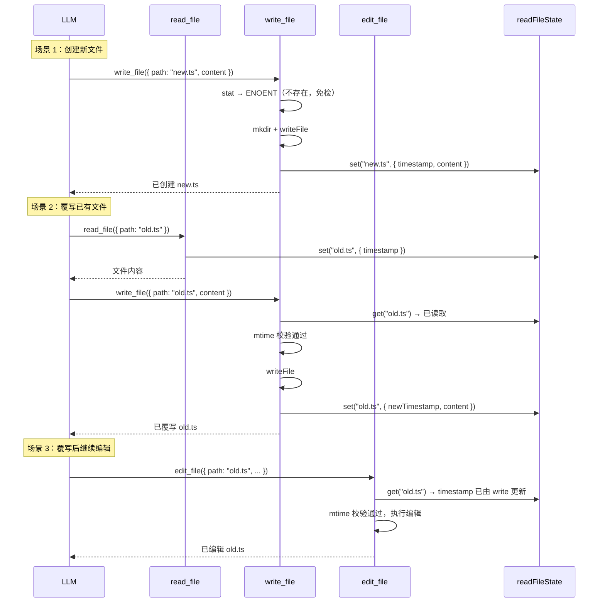

# Write File Tool 设计

## 背景

当前 `write_file` 工具为最小可用版本——仅做路径解析、目录创建和内容写入。参考 Claude Code 的 `FileWriteTool` 设计，本文档规划 `write_file` 的完整升级方案，重点解决**读写一致性**、**安全校验**和**工具协作**三大问题。

---

## 参考：Claude Code FileWriteTool 核心设计

Claude Code 的 `FileWriteTool` 有以下关键特性：

1. **读前置校验**：对已存在的文件，必须先用 Read 工具读取后才能写入
2. **时间戳一致性检测**：对比文件 mtime 与 readFileState 缓存，防止覆盖外部修改
3. **权限系统集成**：通过 `checkPermissions` + wildcard pattern 做路径级权限控制
4. **输入校验层**：拒绝向 deny 列表中的路径写入、拦截 UNC 路径（Windows NTLM 泄露）
5. **写后状态更新**：写入后立即刷新 readFileState，后续编辑不会被时间戳拒绝
6. **LSP 联动**：写入后通知 LSP server（didChange + didSave），触发诊断更新
7. **文件历史追踪**：写入前备份，支持回退
8. **Diff 输出**：对已存在文件的覆写生成 structured patch，方便用户审查
9. **Prompt 约束**：明确引导 LLM 优先使用 Edit 工具，Write 仅用于新建或完全重写

---

## 设计目标

1. **一致性**：与 `read_file` / `edit_file` 共享 `readFileState`，防止覆盖外部修改
2. **安全性**：路径规范化、危险路径拦截、文件大小预检
3. **协作**：与 `edit_file` 明确职责边界，通过 prompt 引导 LLM 正确选择工具
4. **可观测**：通过 metadata 输出变更统计（行数、字节数），供事件系统消费

---

## 参数设计

```typescript
const inputSchema = z.object({
  /** 文件路径（相对 cwd 或绝对路径，支持 ~ 展开） */
  path: z.string().min(1).describe('File path (relative to cwd or absolute)'),
  /** 要写入的内容 */
  content: z.string().describe('The content to write to the file'),
})
```

参数设计保持简洁，不做过度抽象。路径解析和 `~` 展开复用 `@mech/shared` 的 `expandPath`。

---

## 核心机制

### 1. 读前置校验（Must Read Before Write）

**原则**：对已存在的文件执行覆写时，必须先读取过该文件。

与 Claude Code 相同的策略——防止 LLM 在未理解文件内容的情况下盲目覆写，避免数据丢失。

```typescript
const readFileState = getReadFileState(ctx.store)
const resolvedPath = resolve(ctx.cwd, expandPath(input.path))

// 检查文件是否存在
let fileExists = false
try {
  await stat(resolvedPath)
  fileExists = true
} catch (e) {
  if (!isENOENT(e)) throw e
}

// 文件已存在但未读取过 → 拒绝
if (fileExists && readFileState && !readFileState.has(resolvedPath)) {
  return {
    content:
      '文件已存在但尚未被读取。请先使用 read_file 读取文件内容，或使用 edit_file 进行局部修改。',
    isError: true,
  }
}
```

**豁免条件**：

- 文件不存在（创建新文件场景）→ 直接放行
- `readFileState` 尚未初始化（首轮兼容）→ 放行

### 2. 文件修改时间戳校验

**原则**：若文件在 read 之后被外部修改，拒绝写入并要求重新读取。

```typescript
if (fileExists && readFileState) {
  const cached = readFileState.get(resolvedPath)
  if (cached) {
    const currentMtime = Math.floor((await stat(resolvedPath)).mtimeMs)
    if (currentMtime > cached.timestamp) {
      return {
        content:
          '文件自上次读取后已被外部修改（可能是用户编辑或 linter/formatter）。请重新读取后再写入。',
        isError: true,
      }
    }
  }
}
```

### 3. 写入后更新 readFileState

写入成功后立即更新缓存，确保后续 `edit_file` 的时间戳校验能通过：

```typescript
if (readFileState) {
  const newMtime = Math.floor((await stat(resolvedPath)).mtimeMs)
  readFileState.set(resolvedPath, {
    timestamp: newMtime,
    offset: undefined,
    limit: undefined,
    content, // 全文已知
  })
}
```

### 4. 路径安全性

复用 `edit_file` 中已有的安全检查：

```typescript
// 危险设备路径拦截
if (BLOCKED_DEVICE_PATHS.has(resolvedPath)) {
  return { valid: false, error: `无法写入设备文件 ${input.path}。` }
}

// 路径规范化，防止路径穿越
const resolvedPath = resolve(ctx.cwd, expandPath(input.path))
```

### 5. 文件大小预检（覆写场景）

对已存在的大文件覆写进行预检，避免误覆盖重要的大文件：

```typescript
const MAX_WRITE_FILE_SIZE = 10 * 1024 * 1024 // 10 MB

if (fileExists) {
  const stats = await stat(resolvedPath)
  if (stats.size > MAX_WRITE_FILE_SIZE) {
    return {
      content: `目标文件过大 (${formatSize(stats.size)})，拒绝覆写。请确认是否需要覆盖此文件。`,
      isError: true,
    }
  }
}
```

---

## Prompt 设计

```typescript
getPrompt(ctx: ToolPromptContext): string {
  const hasEditTool = ctx.availableTools.includes('edit_file')
  const editHint = hasEditTool
    ? '\n- 修改现有文件时优先使用 edit_file 工具（仅发送 diff），write_file 用于创建新文件或完全重写'
    : ''

  return `将内容写入文件，如果文件已存在则覆写，不存在则创建（自动创建父目录）。

使用说明：
- path 参数支持绝对路径或相对于工作目录（${ctx.cwd}）的相对路径
- 如果目标文件已存在，必须先使用 read_file 读取后才能覆写${editHint}
- 不要创建文档文件（*.md）或 README，除非用户明确要求
- content 为完整的文件内容，会直接覆盖目标文件的全部内容`
}
```

### Prompt 设计要点

1. **引导工具选择**：明确说明 `edit_file` 优先，`write_file` 用于新建或完全重写
2. **强调读前置**：防止 LLM 跳过读取直接覆写
3. **动态适配**：根据 `availableTools` 判断是否存在 `edit_file`，动态调整提示

---

## validateInput 实现

```typescript
validateInput(input) {
  const rawPath = expandPath(input.path)

  // 空内容不拦截（允许创建空文件）

  // 危险设备路径
  if (BLOCKED_DEVICE_PATHS.has(rawPath)) {
    return { valid: false, error: `无法写入设备文件 ${input.path}。` }
  }

  return { valid: true }
}
```

`validateInput` 只放**与运行环境无关的固有约束**。路径是否存在、是否已读取等运行时约束放在 `execute` 中处理。

---

## 执行流程

```
输入校验 (validateInput)
    ↓
路径解析 (expandPath + resolve)
    ↓
文件存在性检查 (stat)
    ↓
 ┌─ 文件存在 ───────────────────────────┐
 │  读前置校验 (readFileState 检查)       │
 │  时间戳校验 (mtime vs cached)         │
 │  文件大小预检 (stat → size check)     │
 └───────────────────────────────────────┘
    ↓
创建父目录 (mkdir -p)
    ↓
写入文件 (writeFile)
    ↓
更新 readFileState (刷新 timestamp + content)
    ↓
返回结果 (含 metadata: linesWritten, bytesWritten, type)
```

---

## 输出格式

### 成功 —— 创建新文件

```
已创建 path/to/file.ts（42 行，1.2 KB）
```

### 成功 —— 覆写已有文件

```
已覆写 path/to/file.ts（42 行，1.2 KB）
```

### 失败示例

```
文件已存在但尚未被读取。请先使用 read_file 读取文件内容，或使用 edit_file 进行局部修改。
```

```
文件自上次读取后已被外部修改（可能是用户编辑或 linter/formatter）。请重新读取后再写入。
```

```
目标文件过大 (15.2 MB)，拒绝覆写。请确认是否需要覆盖此文件。
```

---

## 与 readFileState 的联动

`write_file` 与 `read_file` / `edit_file` 共享同一个 `readFileState`，形成完整的读写一致性闭环：



---

## 与 edit_file 的职责划分

| 维度        | write_file                           | edit_file                          |
| ----------- | ------------------------------------ | ---------------------------------- |
| 主要用途    | 创建新文件、完全重写                 | 局部精确修改                       |
| Token 效率  | 低（发送完整文件内容）               | 高（仅发送 diff）                  |
| 读前置要求  | 仅覆写时要求                         | 始终要求（除创建模式外）           |
| 适用场景    | 新建配置文件、生成代码文件、完全重写 | 修 bug、重构、添加函数、修改导入等 |
| Prompt 引导 | 声明为次选，引导 LLM 优先用 edit     | 声明为首选编辑工具                 |

---

## 与当前实现的差距

当前 `write_file` 实现（`packages/core/src/tools/builtins/write-file.ts`）仅 30 行，缺失：

| 能力                   | 当前状态 | 目标状态 |
| ---------------------- | -------- | -------- |
| 路径解析 + ~ 展开      | ❌       | ✅       |
| 危险路径拦截           | ❌       | ✅       |
| 读前置校验             | ❌       | ✅       |
| 时间戳一致性校验       | ❌       | ✅       |
| 写后更新 readFileState | ❌       | ✅       |
| 文件大小预检           | ❌       | ✅       |
| 动态 Prompt            | ❌       | ✅       |
| 统计 metadata 输出     | ❌       | ✅       |
| validateInput          | ❌       | ✅       |

---

## 实现计划

### Phase 1：安全基础

- 路径规范化（`expandPath` + `resolve`）
- 危险设备路径拦截
- `validateInput` 实现

### Phase 2：读写一致性

- 接入 `readFileState`（通过 `ctx.store.readFileState`）
- 读前置校验
- 时间戳校验
- 写后更新状态

### Phase 3：体验优化

- 动态 `getPrompt`（根据 availableTools 适配提示内容）
- 丰富输出信息（行数、字节数、创建/覆写类型）
- metadata 输出（供事件系统/UI 消费）
- 文件大小预检

---

## 不做的事情（与 Claude Code 的差异）

以下 Claude Code 特有的功能在 mech-code 当前阶段**不纳入**：

1. **LSP 联动**：当前无内置 LSP manager，后续可通过中间件扩展
2. **Git diff 输出**：当前无 git 集成需求，后续按需添加
3. **文件历史追踪**：当前无内置 undo 机制，暂不实现
4. **权限系统**：当前通过 HITL 中间件做审批，不需要内置 permission matcher
5. **Skills 发现**：当前 skills 系统独立于工具执行流程
6. **Analytics / 事件上报**：当前通过 EventEmitter 事件系统覆盖，无需工具内嵌
