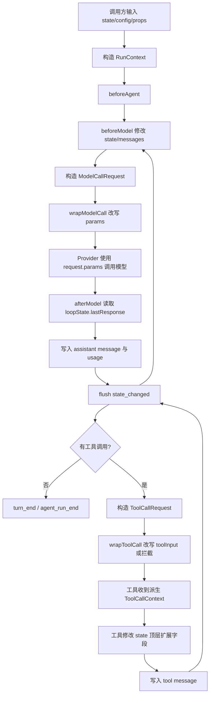

# Agent Loop State/Context 分层设计

> 当前版本说明 Agent Loop 的四层运行模型：`state / props / runtime / loopState`。本设计取代旧的 `AgentState.store`、`propsSchema`、`callMessages` 投影设计。

## 1. 运行入参

`agent.run()`、`agent.complete()` 和 `agent.resume()` 的运行时入参统一分为三类：

```ts
agent.run({
  state,
  config: {
    maxTurns: 20,
    signal: abortController.signal,
  },
  props: {
    cwd: process.cwd(),
    platform: process.platform,
  },
})
```

| 字段     | 语义                                         | 持久化 |
| -------- | -------------------------------------------- | ------ |
| `state`  | 会话动态状态，Agent 和中间件会直接修改       | 是     |
| `config` | 本次 run 的控制配置，如 `maxTurns`、`signal` | 否     |
| `props`  | 本次 run 的只读环境信息，如 `cwd`、系统信息  | 否     |

`signal` 属于 `config`，因为它控制当前任务终止；`cwd` 属于 `props`，因为它描述本次运行环境。

## 2. AgentState

`AgentState` 是会话状态唯一真相。固定内部字段只有：

- `messages`：真实消息历史。
- `usage`：跨多次 run 累计的 token 用量。

中间件和工具可以直接扩展顶层字段，例如：

- `state.todos`
- `state.shellCwd`
- `state.readFileState`

不再使用 `state.store`。中间件可通过 `AgentMiddleware.state` 声明默认扩展 state，Loop 在 run 开始时合并到 `AgentState` 顶层，且不覆盖调用方已有字段。

## 3. RunContext

中间件 hook、wrap 和工具执行收到同一套分层 Context：

```ts
interface RunContext {
  state: AgentState
  props: Readonly<Record<string, unknown>>
  runtime: AgentRuntime
  loopState: AgentLoopState
}
```

### 3.1 state

`state` 是真实可变会话状态。中间件修改消息时直接修改 `state.messages`，不再有 `callMessages` 快照投影。

内部注入消息也保留在真实历史中，并使用 `_meta` 标记：

```ts
{
  role: 'user',
  content: 'Todo reminder...',
  _meta: { source: 'agent', injected: true, kind: 'todo_reminder' },
}
```

Provider 序列化时只发送模型需要的 `role/content/toolCallId` 等字段，不发送 `_meta`。

### 3.2 props

`props` 是调用方传入的只读运行环境，不进入 checkpoint。工具和中间件通过 `ctx.props.cwd` 读取当前工作目录。

### 3.3 runtime

`runtime` 是运行期能力和配置：

- `runId`
- `provider`
- `system`
- `tools`
- `middleware`
- `signal`
- `emit(event)`
- `notifyStateChanged(reason, keys?)`

`runtime.system` 和 `runtime.tools` 是构造模型请求的默认运行配置。中间件如果只想影响某一次真实模型调用，应在 `wrapModelCall` 中改写 `ModelCallRequest.params.system`、`params.tools` 或 `params.messages`，避免把一次调用的策略写回全局 runtime。

### 3.4 loopState

`loopState` 是 loop 内部控制状态：

- `turnIndex`
- `stopReason`
- `lastResponse`
- `pendingToolCalls`
- `stateRevision`

`loopState` 通常不持久化；暂停恢复只通过 checkpoint 保存 `state`、pending tool calls、暂停原因和 `turnIndex`。

## 4. State Changed 事件

外部通过事件流感知 AgentState 变化，不提供额外的订阅式 store API。

```ts
interface StateChangedEvent {
  type: 'state_changed'
  runId: string
  revision: number
  changedKeys: string[]
  reason: string
  state: SerializableAgentState
}
```

Loop 在 hook 结束、模型响应写入、工具结果写入、工具执行后、turn end、run end 等边界比较顶层 state 快照，并在有变化时发出 `state_changed`。中间件和工具也可以通过 `runtime.notifyStateChanged(reason, keys?)` 显式标记变化原因或要求尽快发出事件。

## 5. 工具状态约定

工具执行 Context 与中间件一致，并附加工具调用字段：

```ts
interface ToolCallContext extends RunContext {
  toolCallId: string
  toolName: string
  toolInput: Record<string, unknown>
}
```

内置工具使用顶层 state：

- `bash`：`state.shellCwd`
- `read_file` / `edit_file` / `write_file`：`state.readFileState`
- `write_todos`：`state.todos`

## 6. 流程图


