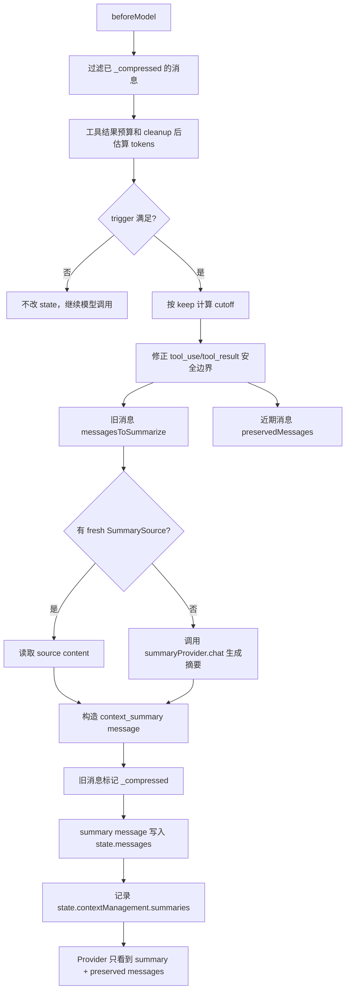
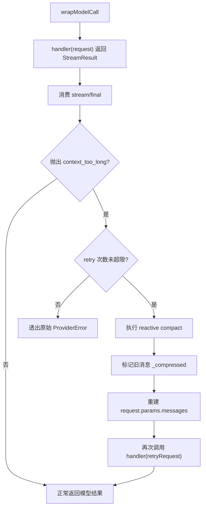

# Context Management Middleware 设计

> 本文只描述通用上下文预算管理中间件的目标方案，不包含实现代码。旁路 Agent 笔记能力独立放在 `docs/17-session-notes-middleware-design.md`。

## 1. 设计目标

`contextManagementMiddleware` 负责控制“最终发送给 Provider 的上下文窗口”。它处理模型可见消息、工具结果和压缩重试，但不负责维护长期或旁路笔记。

核心目标：

- 控制工具大结果，避免一次工具输出撑爆上下文。
- 定期清理旧工具结果，减少冷缓存后的历史负担。
- 在接近上下文阈值时主动执行全量摘要压缩。
- 在模型 API 返回 `context_too_long` 时执行兜底压缩并重试。
- 保持 `state.messages` 作为完整会话真相，通过 `_compressed` 控制 Provider 可见窗口。

非目标：

- 不启动旁路 Agent。
- 不维护 `.mech/session-memory.md`。
- 不设计 UI 状态。
- 不引入 `store` 或 `callMessages`。
- 不把压缩策略写进 core loop 业务逻辑。

## 2. 与 Session Notes Middleware 的边界

上下文管理中间件是“请求预算管理层”，旁路笔记中间件是“会话笔记维护层”。

| 能力                             | `contextManagementMiddleware` | `sessionNotesMiddleware` |
| -------------------------------- | ----------------------------- | ------------------------ |
| 工具大结果 preview/store         | 是                            | 否                       |
| 定期清理旧 tool result           | 是                            | 否                       |
| 主动全量 compact                 | 是                            | 否                       |
| API overflow 后 reactive compact | 是                            | 否                       |
| 周期性启动旁路 Agent             | 否                            | 是                       |
| 写入 session memory markdown     | 否                            | 是                       |
| 提供 SummarySource               | 消费                          | 提供                     |
| 修改 `state.messages` 可见性     | 是                            | 否                       |

二者组合时，`contextManagementMiddleware` 可以读取 `sessionNotesMiddleware` 暴露的 `SummarySource`，但不依赖它。没有旁路笔记时，通用上下文管理仍然能用 `summaryProvider` 对历史消息做全量摘要。

## 3. Middleware API 草案

```ts
interface ContextManagementMiddlewareOptions {
  /**
   * 主模型 Provider，通常与 AgentConfig.provider 相同。
   * 如果实现可从 ctx.runtime.provider 读取，则此项可选。
   */
  provider?: LLMProvider

  /**
   * 摘要 Provider。推荐显式配置为便宜且稳定的模型。
   * 未配置时可回退到主 Provider，但 CLI 层应鼓励独立配置。
   */
  summaryProvider?: LLMProvider

  /** 当前主模型的上下文窗口，可是固定数值，也可由函数根据 provider/model 推导。 */
  modelContextWindow?: number | ((ctx: RunContext) => number)

  /** 为主模型输出预留的 token，避免压缩后仍没有回答空间。 */
  reservedOutputTokens?: number

  /** token 估算器，默认使用 @mech-code/core 的 estimateMessagesTokens。 */
  tokenCounter?: TokenCounter

  /** 主动 compact 触发条件。数组之间是 OR，单个对象内是 AND。 */
  trigger?: ContextTrigger | ContextTrigger[]

  /** compact 后保留最近上下文的策略。 */
  keep?: KeepStrategy

  /** 全量摘要配置。 */
  summary?: SummaryOptions

  /** 工具大结果预算与存储配置。 */
  toolResults?: ToolResultBudgetOptions

  /** 定期清理旧工具结果配置。 */
  cleanup?: ToolResultCleanupOptions

  /** API context_too_long 后的兜底 compact 配置。 */
  reactiveCompact?: ReactiveCompactOptions
}

type ContextTrigger = {
  tokens?: number
  messages?: number
  fraction?: number
  toolResultChars?: number
}

type KeepStrategy = { messages: number } | { tokens: number } | { fraction: number }

interface SummaryOptions {
  prompt?: string
  prefix?: string
  maxTokens?: number
  temperature?: number
  /**
   * 可选摘要来源，例如 sessionNotesMiddleware.source。
   * context manager 只消费 source，不负责更新 source。
   */
  sources?: SummarySource[]
  sourcePolicy?: 'prefer_fresh_source' | 'always_regenerate' | 'source_then_refine'
}

interface ToolResultBudgetOptions {
  maxResultChars?: number
  maxResultTokens?: number
  maxResultsPerMessageChars?: number
  previewChars?: number
  strategy?: 'preview_only' | 'preview_and_store' | 'truncate'
  storage?: ToolResultStorageOptions
}

type ToolResultStorageOptions = { type: 'state' } | { type: 'file'; dir: string }

interface ToolResultCleanupOptions {
  enabled?: boolean
  trigger?: {
    idleMinutes?: number
    turns?: number
    tokens?: number
  }
  keepRecentToolResults?: number
  replacementText?: string
}

interface ReactiveCompactOptions {
  enabled?: boolean
  maxRetries?: number
  fallbackKeep?: KeepStrategy
}
```

推荐默认值：

- `trigger` 默认不启用，避免安装中间件后悄悄压缩。
- `keep` 默认 `{ messages: 20 }`。
- `reservedOutputTokens` 默认取 `min(providerMaxOutputTokens, 20000)`。
- `toolResults.maxResultChars` 默认 `50000`。
- `toolResults.maxResultsPerMessageChars` 默认 `200000`。
- `cleanup.enabled` 默认 `false`。
- `reactiveCompact.enabled` 默认 `true`。

## 4. State 设计

中间件只写入顶层 `state.contextManagement`，不扩展 core 固定字段。

```ts
interface ContextManagementState {
  summaries: ContextSummaryRecord[]
  toolResults: Record<string, StoredToolResultRecord>
  cleanup: {
    lastCleanupAt?: number
    lastCleanupTurn?: number
    clearedToolResultCount?: number
  }
  failures: {
    compactConsecutiveFailures: number
    reactiveCompactConsecutiveFailures: number
    toolStorageConsecutiveFailures: number
  }
}

interface ContextSummaryRecord {
  id: string
  turnIndex: number
  source: 'auto_compact' | 'reactive_compact' | 'manual_compact'
  summaryMessageId: string
  compressedMessageCount: number
  estimatedInputTokensBefore: number
  estimatedInputTokensAfter: number
  createdAt: number
}

interface StoredToolResultRecord {
  toolCallId: string
  toolName: string
  originalChars: number
  originalEstimatedTokens: number
  preview: string
  storage?: { type: 'state'; content: string } | { type: 'file'; path: string }
  cleared?: true
  createdAt: number
}
```

消息标记规则：

```ts
type ContextSummaryMessage = AgentMessage & {
  role: 'user'
  _meta: {
    source: 'agent'
    injected: true
    kind: 'context_summary'
    summaryId: string
  }
}
```

- 被压缩掉的原始消息保留在 `state.messages`，标记 `_compressed: true`。
- summary message 不标记 `_compressed`，后续 Provider 可见。
- Provider 序列化前必须过滤 `_compressed`，并继续剥离 `_meta`。
- checkpoint/resume 持久化完整 state，因此完整 transcript 仍可审计。

## 5. 工具大结果处理

工具大结果处理发生在工具执行后、tool message 写入模型历史前或写入后立即整理。目标是保证模型看到的是可读 preview，而不是完整巨型输出。

处理策略：

1. 计算单个工具结果字符数与估算 token。
2. 如果超过 `maxResultChars` 或 `maxResultTokens`，进入预算处理。
3. `preview_only`：只保留 preview，不保存完整内容。
4. `preview_and_store`：保存完整内容到 state 或文件，tool message 只保留 preview 和引用。
5. `truncate`：直接截断为 preview，不记录外部引用。
6. 如果同一轮多个 tool result 聚合超过 `maxResultsPerMessageChars`，优先处理最大的结果。

工具结果写回示例：

```txt
Tool result is large and has been stored.

Preview:
...

Full result:
.mech/tool-results/run_xxx/tool_call_abc.txt
```

流程图：


## 6. 定期清理旧 Tool Result

定期清理不是后台定时器，而是在 `beforeModel` 检查是否需要清理。这样不会引入额外运行线程，也符合 Agent Loop 生命周期。

触发维度：

- `idleMinutes`：距离上次 assistant/main turn 超过指定时间。
- `turns`：距离上次 cleanup 超过指定 turn 数。
- `tokens`：当前 Provider 可见消息估算 token 超过阈值。

清理策略：

- 只清理被标记为可清理的旧 tool result。
- 保留最近 `keepRecentToolResults` 个工具结果。
- 将旧 tool message content 替换为 `replacementText`。
- 保留 `toolCallId`、`toolName` 和 state 记录，避免破坏工具调用链可追溯性。

## 7. 主动全量摘要 Compact

主动 compact 在 `beforeModel` 执行，位置在工具结果预算和定期清理之后、构造最终 Provider 请求之前。

触发判断：

- 先过滤 `_compressed`，得到当前 Provider 可见消息。
- 估算 messages token。
- 按 `trigger` 判断是否达到阈值。
- `trigger` 数组是 OR；单个 trigger 对象内是 AND。

保留策略：

- `keep.messages`：保留最近 N 条 Provider 可见消息。
- `keep.tokens`：保留最近不超过 N tokens 的 suffix。
- `keep.fraction`：保留上下文窗口指定比例以内的 suffix。

安全 cutoff 约束：

- 不能让保留区以孤立 tool result 开头。
- 不能拆开 assistant `tool_use` 与后续对应 `tool` message。
- 如果 cutoff 会拆开工具调用对，向前移动 cutoff，让整组 tool use/result 留在保留区。
- 如果历史存在孤儿 tool result，不抛异常，向后跳过或一起压缩。

摘要生成：

- 优先读取 `summary.sources` 中 fresh 的 `SummarySource`。
- 如果没有可用 source，调用 `summaryProvider.chat()` 对旧消息生成摘要。
- 如果 source 存在但策略是 `source_then_refine`，则用 summary provider 把 source 和待压缩消息再整理为 compact summary。
- 摘要结果写入一条内部 user message。
- cutoff 前旧消息标记 `_compressed: true`。

流程图：



## 8. API Overflow 兜底压缩

响应式 compact 处理 Provider 已经返回上下文超限的情况。它不替代主动 compact，而是最后一道保险。

触发条件：

- Provider 抛出 `ProviderError`。
- `error.code === 'context_too_long'`。
- `reactiveCompact.enabled !== false`。
- 当前请求还没有超过 `maxRetries`。

处理流程：

1. 捕获 `context_too_long`。
2. 用 `reactiveCompact.fallbackKeep` 计算更激进的 cutoff。
3. 执行 full compact。
4. 重建 `request.params.messages`。
5. 重试本次模型调用。
6. 如果仍失败，透出原始错误，不无限递归。

当前 core 边界：

- 现有 `wrapModelCall` 可以包住 `provider.stream()` 的创建。
- 但流式错误可能在消费 `StreamResult.stream` 或等待 `StreamResult.final` 时才抛出。
- 因此后续实现需要 core 提供一个小型 `wrapStreamResult()` helper，允许 middleware 包装 stream/final 错误并触发重试。
- 本文只提出该边界，不在本次文档任务中实现。

流程图：



## 9. 与 Core 的边界

该中间件尽量放在 `@mech-code/middleware` 中，但需要 core 保持以下通用能力：

- Provider 请求构造时过滤 `_compressed` 消息。
- Provider 序列化继续剥离 `_meta`。
- `state_changed` 能反映 `state.contextManagement` 和 `state.messages` 的变化。
- 提供或允许实现 `wrapStreamResult()`，使 `wrapModelCall` 可以处理流式错误。

core 不应包含：

- 具体 token 阈值。
- 工具结果落盘策略。
- compact prompt。
- SummarySource 读取策略。
- CLI 配置解析。

## 10. 与 Session Notes 的组合

组合方式示例：

```ts
const sessionNotes = sessionNotesMiddleware({ provider: memoryProvider })

const contextManagement = contextManagementMiddleware({
  summaryProvider,
  summary: {
    sources: [sessionNotes.source],
    sourcePolicy: 'prefer_fresh_source',
  },
})
```

组合原则：

- `sessionNotesMiddleware` 可以先注册，也可以单独使用。
- `contextManagementMiddleware` 只读取 `SummarySource`，不调用旁路 Agent 更新笔记。
- 如果 source 不 fresh 或不可用，context manager 必须能自行 full compact。
- 两个中间件分别维护 `state.sessionNotes` 和 `state.contextManagement`。

## 11. 后续实现验收点

后续实现时至少验证：

- 超大工具结果会被 preview/store，Provider 不收到完整大结果。
- cleanup 达到阈值后清理旧 tool result，并保留最近 N 个。
- 主动 compact 达到 trigger 后写入 summary message，并标记旧消息 `_compressed`。
- compact cutoff 不拆散 tool use/result。
- Provider payload 不包含 `_compressed` 和 `_meta`。
- `context_too_long` 会触发 reactive compact 并最多重试指定次数。
- 没有 `sessionNotesMiddleware` 时仍可正常 compact。
- 有 fresh SummarySource 时优先复用旁路笔记。
