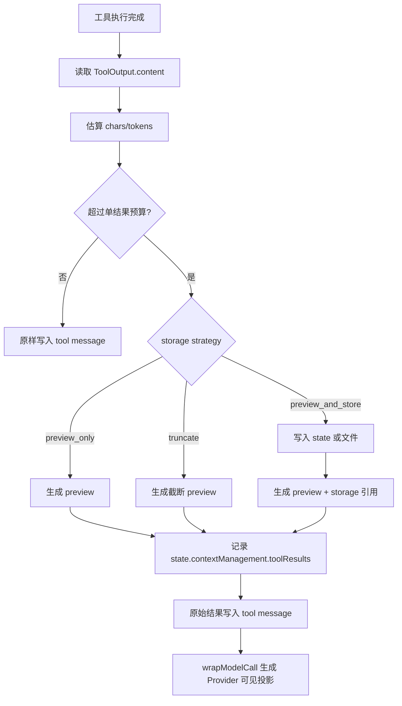
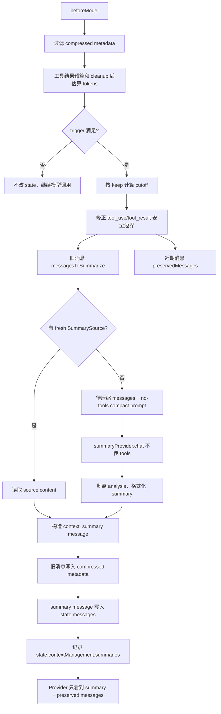
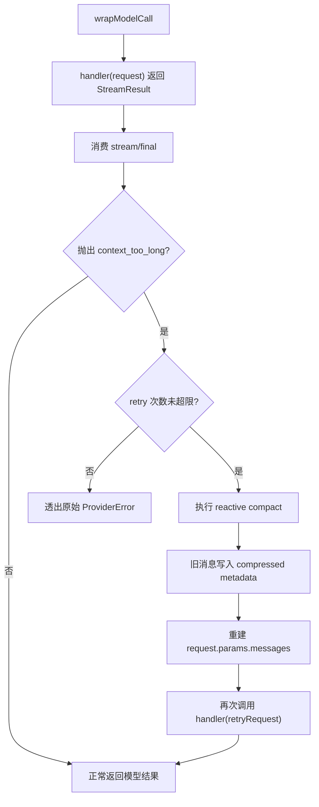

# Context Management Middleware 设计

> 本文描述通用上下文预算管理中间件的设计与当前实现约定。旁路 Agent 笔记能力独立放在 `docs/17-session-notes-middleware-design.md`。

## 1. 设计目标

`contextManagementMiddleware` 负责控制“最终发送给 Provider 的上下文窗口”。它处理模型可见消息、工具结果和压缩重试，但不负责维护长期或旁路笔记。

核心目标：

- 控制工具大结果，避免一次工具输出撑爆上下文。
- 定期清理旧工具结果，减少冷缓存后的历史负担。
- 在接近上下文阈值时主动执行全量摘要压缩。
- 在模型 API 返回 `context_too_long` 时执行兜底压缩并重试。
- 保持 `state.messages` 作为完整会话真相，通过 message metadata 控制 Provider 可见窗口。

非目标：

- 不启动旁路 Agent。
- 不维护 `.mech/session-memory.md`。
- 不设计 UI 状态。
- 不引入 `store` 或 `callMessages`。
- 不把压缩策略写进 core loop 业务逻辑。
- 不让 core 理解 `compressed` 语义；压缩标记和过滤都属于该中间件。

## 2. 与 Session Notes Middleware 的边界

上下文管理中间件是“请求预算管理层”，旁路笔记中间件是“会话笔记维护层”。

| 能力                             | `contextManagementMiddleware` | `sessionNotesMiddleware` |
| -------------------------------- | ----------------------------- | ------------------------ |
| 工具大结果 preview/store         | 是                            | 否                       |
| 定期清理旧 tool result           | 是                            | 否                       |
| 主动全量 compact                 | 是                            | 否                       |
| API overflow 后 reactive compact | 是                            | 否                       |
| 周期性启动旁路 Agent             | 否                            | 是                       |
| 写入 session memory markdown     | 否                            | 是                       |
| 提供 SummarySource               | 消费                          | 提供                     |
| 维护 message metadata 可见性     | 是                            | 否                       |

二者组合时，`contextManagementMiddleware` 可以读取 `sessionNotesMiddleware` 暴露的 `SummarySource`，但不依赖它。没有旁路笔记时，通用上下文管理仍然能用 `summaryProvider` 对历史消息做全量摘要。

## 3. Middleware API

```ts
interface ContextManagementMiddlewareOptions {
  /**
   * 主模型 Provider，通常与 AgentConfig.provider 相同。
   * 如果实现可从 ctx.runtime.provider 读取，则此项可选。
   */
  provider?: LLMProvider

  /**
   * 摘要 Provider。推荐显式配置为便宜且稳定的模型。
   * 未配置时可回退到主 Provider，但 CLI 层应鼓励独立配置。
   */
  summaryProvider?: LLMProvider

  /** 当前主模型的上下文窗口，可是固定数值，也可由函数根据 provider/model 推导。 */
  modelContextWindow?: number | ((ctx: RunContext) => number)

  /** 为主模型输出预留的 token，避免压缩后仍没有回答空间。 */
  reservedOutputTokens?: number

  /** token 估算器，默认使用 @mech-code/core 的 estimateMessagesTokens。 */
  tokenCounter?: TokenCounter

  /** 主动 compact 触发条件。数组之间是 OR，单个对象内是 AND。 */
  trigger?: ContextTrigger | ContextTrigger[]

  /** compact 后保留最近上下文的策略。 */
  keep?: KeepStrategy

  /** 全量摘要配置。 */
  summary?: SummaryOptions

  /** 工具大结果预算与存储配置。 */
  toolResults?: ToolResultBudgetOptions

  /** 定期清理旧工具结果配置。 */
  cleanup?: ToolResultCleanupOptions

  /** API context_too_long 后的兜底 compact 配置。 */
  reactiveCompact?: ReactiveCompactOptions
}

type ContextTrigger = {
  tokens?: number
  messages?: number
  fraction?: number
}

type KeepStrategy = { messages: number } | { tokens: number } | { fraction: number }

interface SummaryOptions {
  prompt?: string
  prefix?: string
  maxTokens?: number
  temperature?: number
  /**
   * 可选摘要来源，例如 sessionNotesMiddleware.source。
   * context manager 只消费 source，不负责更新 source。
   */
  sources?: SummarySource[]
  sourcePolicy?: 'prefer_fresh_source' | 'always_regenerate' | 'source_then_refine'
}

interface SummarySource {
  name: string
  load(ctx: RunContext): Awaitable<SummarySourceResult | null>
}

interface SummarySourceResult {
  content: string
  coveredUntilMessageId?: string
  coveredUntilMessageIndex?: number
  estimatedTokens?: number
  fresh: boolean
  metadata?: Record<string, unknown>
}

interface ToolResultBudgetOptions {
  maxResultChars?: number
  maxResultTokens?: number
  previewChars?: number
  strategy?: 'preview_only' | 'preview_and_store' | 'truncate'
  storage?: ToolResultStorageOptions
}

type ToolResultStorageOptions = { type: 'state' } | { type: 'file'; dir: string }

interface ToolResultCleanupOptions {
  enabled?: boolean
  trigger?: {
    idleMinutes?: number
    turns?: number
    tokens?: number
  }
  keepRecentToolResults?: number
  replacementText?: string
}

interface ReactiveCompactOptions {
  enabled?: boolean
  maxRetries?: number
  fallbackKeep?: KeepStrategy
}
```

推荐默认值：

- `trigger` 默认不启用，避免安装中间件后悄悄压缩。
- `keep` 默认 `{ messages: 20 }`。
- `reservedOutputTokens` 默认取 `min(floor(modelContextWindow * 0.2), 20000)`。
- `toolResults.maxResultChars` 默认 `50000`。
- `toolResults.previewChars` 默认 `8000`。
- `toolResults.strategy` 默认 `preview_only`。
- `cleanup.enabled` 默认 `false`。
- `cleanup.keepRecentToolResults` 默认 `10`。
- `reactiveCompact.enabled` 默认 `true`。
- `reactiveCompact.maxRetries` 默认 `1`。

## 4. State 设计

中间件只写入顶层 `state.contextManagement`，不扩展 core 固定字段。

初始化规则：

- `AgentMiddleware.state` 声明默认 `state.contextManagement`。
- core 在 run 初始化阶段通过 `bindMiddlewareState()` 合并默认 state。
- `beforeAgent` 负责一次性确保或迁移 `state.contextManagement`。
- 其他业务 helper 只读取已初始化 state；缺失时视为 lifecycle invariant 破坏，不再偷偷创建。

```ts
interface ContextManagementState {
  summaries: ContextSummaryRecord[]
  toolResults: Record<string, StoredToolResultRecord>
  cleanup: {
    lastCleanupAt?: number
    lastCleanupTurn?: number
    clearedToolResultCount?: number
  }
  failures: {
    compactConsecutiveFailures: number
    reactiveCompactConsecutiveFailures: number
    toolStorageConsecutiveFailures: number
  }
}

interface ContextSummaryRecord {
  id: string
  turnIndex: number
  source: 'auto_compact' | 'reactive_compact' | 'manual_compact'
  summaryMessageId: string
  compressedMessageCount: number
  estimatedInputTokensBefore: number
  estimatedInputTokensAfter: number
  createdAt: number
}

interface StoredToolResultRecord {
  toolCallId: string
  toolName: string
  originalChars: number
  originalEstimatedTokens: number
  preview: string
  storage?: { type: 'state'; content: string } | { type: 'file'; path: string }
  cleared?: true
  createdAt: number
}
```

消息标记规则：

```ts
type ContextSummaryMessage = UserMessage & {
  metadata: {
    source: 'agent'
    injected: true
    kind: 'context_summary'
    contextManagement: {
      summaryId: string
    }
  }
}

type CompressedMessageMetadata = {
  contextManagement: {
    compressed: true
    summaryId: string
  }
}
```

- `AgentState.messages` 使用 core 的 `AgentMessage` class（如 `UserMessage`、`ToolMessage`），不是 plain object。
- 被压缩掉的原始消息保留在 `state.messages`，写入 `message.metadata.contextManagement.compressed = true`。
- summary message 使用 `new UserMessage(...)` 创建，并写入 `metadata.kind = 'context_summary'` 和 `metadata.contextManagement.summaryId`。
- summary message 不写 `compressed: true`，后续 Provider 可见。
- Provider 可见消息过滤只发生在 `contextManagementMiddleware.wrapModelCall`：中间件从 `state.messages` 过滤自身 metadata 后重建 `request.params.messages: AgentMessage[]`。
- core 的 provider 请求构造和 provider serializer 都不理解 `compressed` 语义；serializer 只在 Provider 内部把 `AgentMessage` 转成厂商 payload。
- message metadata 不进入 Provider payload。
- checkpoint/resume 持久化完整 state，因此完整 transcript 仍可审计；工具大结果和 cleanup 也不应改写 `ToolMessage.content`，只改写 Provider 可见投影。

## 5. 工具大结果处理

工具大结果处理分为“记录”和“投影”两步。工具执行后只登记预算记录，`ToolMessage.content` 仍写入原始结果；真正发送给 Provider 前，`wrapModelCall` 从 `state.messages` 生成一份临时可见消息投影，把超大 tool result 映射为可读 preview。

处理策略：

1. 计算单个工具结果字符数与估算 token。
2. 如果超过 `maxResultChars` 或 `maxResultTokens`，进入预算处理。
3. `preview_only`：只记录 preview；原始内容仍保留在 `ToolMessage.content`。
4. `preview_and_store`：额外保存完整内容到 state 或文件；Provider 可见投影包含 preview 和引用。
5. `truncate`：Provider 可见投影直接截断为 preview，不记录外部引用；原始 `ToolMessage.content` 不被截断。
6. `beforeModel` 会兜底扫描尚未写入 `state.contextManagement.toolResults` 的可见 tool message；如果单条 tool message 自身超过 `maxResultChars` 或 `maxResultTokens`，按同一规则登记预算记录，但不改写消息原文。

工具结果写回示例：

```txt
Tool result is large and has been stored.

Preview:
...

Full result:
.mech/tool-results/run_xxx/tool_call_abc.txt
```

流程图：



## 6. 定期清理旧 Tool Result

定期清理不是后台定时器，而是在 `beforeModel` 检查是否需要清理。这样不会引入额外运行线程，也符合 Agent Loop 生命周期。

触发维度：

- `idleMinutes`：距离上次 assistant/main turn 超过指定时间。
- `turns`：距离上次 cleanup 超过指定 turn 数。
- `tokens`：当前 Provider 可见消息估算 token 超过阈值。

清理策略：

- 只清理被标记为可清理的旧 tool result。
- 保留最近 `keepRecentToolResults` 个工具结果。
- 将旧 tool result 的 state 记录标记为 `cleared`，Provider 可见投影使用 `replacementText`。
- 保留原始 `ToolMessage.content`、`toolCallId`、`toolName` 和 state 记录，避免破坏工具调用链可追溯性与业务持久化。

## 7. 主动全量摘要 Compact

主动 compact 在 `beforeModel` 执行，位置在工具结果预算和定期清理之后、构造最终 Provider 请求之前。

触发判断：

- 先过滤 `metadata.contextManagement.compressed === true` 的消息，得到当前 Provider 可见消息。
- 估算 Provider 可见 messages token；工具结果先经过预算投影，compact 只关心最终发送给 Provider 的总上下文压力。
- 按 `trigger` 判断是否达到阈值。
- `trigger` 数组是 OR；单个 trigger 对象内是 AND。

保留策略：

- `keep.messages`：保留最近 N 条 Provider 可见消息。
- `keep.tokens`：保留最近不超过 N tokens 的 suffix。
- `keep.fraction`：保留上下文窗口指定比例以内的 suffix。

安全 cutoff 约束：

- 不能让保留区以孤立 tool result 开头。
- 不能拆开 assistant `tool_use` 与后续对应 `tool` message。
- 如果 cutoff 会拆开工具调用对，向前移动 cutoff，让整组 tool use/result 留在保留区。
- 如果历史存在孤儿 tool result，不抛异常，向后跳过或一起压缩。

摘要生成：

- 优先读取 `summary.sources` 中 fresh 的 `SummarySource`。
- 如果没有可用 source，调用 `summaryProvider.chat()` 对旧消息生成摘要。该调用模拟 Claude Code 的 compact fork 形态：继承当前 runtime system，把待压缩消息按原 role 作为 `messages` 前缀传入，最后追加一条 `NO_TOOLS_PREAMBLE + BASE_COMPACT_PROMPT` compact 指令。
- compact 摘要调用不传 `tools`，并在 prompt 中明确要求纯文本输出，避免摘要模型消耗 turn 去尝试工具调用。
- 如果 source 存在但策略是 `source_then_refine`，则在 compact 指令中附加 existing session note，用 summary provider 把 source 和待压缩消息再整理为 compact summary。
- compact prompt 要求模型先输出 `<analysis>` 草稿再输出 `<summary>`；写入上下文前必须剥离 `<analysis>`，只保留格式化后的 summary 内容。
- 摘要结果写入一条内部 user message。
- cutoff 前旧消息写入 `message.metadata.contextManagement.compressed = true`。

流程图：



## 8. API Overflow 兜底压缩

响应式 compact 处理 Provider 已经返回上下文超限的情况。它不替代主动 compact，而是最后一道保险。

触发条件：

- Provider 抛出 `ProviderError`。
- `error.code === 'context_too_long'`。
- `reactiveCompact.enabled !== false`。
- 当前请求还没有超过 `maxRetries`。

处理流程：

1. 捕获 `context_too_long`。
2. 用 `reactiveCompact.fallbackKeep` 计算更激进的 cutoff。
3. 执行 full compact。
4. 重建 `request.params.messages`。
5. 重试本次模型调用。
6. 如果仍失败，透出原始错误，不无限递归。

当前 core 边界：

- 现有 `wrapModelCall` 可以包住 `provider.stream()` 的创建。
- 但流式错误可能在消费 `StreamResult.stream` 或等待 `StreamResult.final` 时才抛出。
- core 提供通用 `retryStreamResult()` helper，允许 middleware 在 stream/final 抛错时返回新的 `StreamResult` 重试。
- `retryStreamResult()` 不理解 `context_too_long`、compact 或 compressed 语义；是否重试完全由 middleware 决定。
- 如果当前尝试已经向外 yield 过事件，`retryStreamResult()` 不再重试，避免 UI 收到半段旧输出再拼接重试输出。

流程图：



## 9. 与 Core 的边界

该中间件放在 `@mech-code/middleware` 中。core 只提供通用机制，不包含上下文压缩策略。

core 应提供：

- `AgentMessage` class 体系和 `metadata: Record<string, unknown>`。
- `serializeAgentState()` / `deserializeAgentState()`，保证 checkpoint/resume 后 message class 与 metadata 不丢失。
- Provider 内部消息序列化 helper：只负责把 `AgentMessage` 转成厂商 payload；metadata 不进入 Provider payload。Agent Loop 和 middleware 不直接调用该转换。
- `state_changed`，能反映 `state.contextManagement` 和 `state.messages` 的变化。
- `retryStreamResult()`，使 `wrapModelCall` 可以处理流式错误并按 middleware 决策重试。

core 不应包含：

- `metadata.contextManagement` 或 `compressed` 的语义。
- Provider 可见消息过滤逻辑；过滤只发生在 `contextManagementMiddleware.wrapModelCall`。
- 具体 token 阈值。
- 工具结果落盘策略。
- compact prompt。
- SummarySource 读取策略。
- provider 名称解析或 CLI 配置映射；这些属于 CLI 层。

## 10. CLI 配置方式

CLI 已支持通过配置文件开启上下文管理中间件。`contextManagement` 配置块不存在时不启用；配置块存在时默认启用，显式设置 `enabled: false` 可以关闭。

示例：

```json
{
  "contextManagement": {
    "summaryProvider": "summary",
    "modelContextWindow": 200000,
    "trigger": { "fraction": 0.7 },
    "keep": { "messages": 20 },
    "summary": {
      "maxTokens": 4096,
      "temperature": 0
    },
    "toolResults": {
      "maxResultChars": 50000,
      "previewChars": 8000,
      "strategy": "preview_and_store",
      "storage": { "type": "state" }
    },
    "cleanup": {
      "enabled": true,
      "trigger": { "turns": 10 },
      "keepRecentToolResults": 10
    },
    "reactiveCompact": {
      "enabled": true,
      "maxRetries": 1
    }
  }
}
```

配置规则：

- `provider` 和 `summaryProvider` 是 CLI `providers` 中的 provider 名称，不是直接的 `LLMProvider` 实例。
- 未配置 `provider` 时，context management 使用当前 chat provider。
- 未配置 `summaryProvider` 时，摘要回退到 `provider` 或当前 chat provider。
- 如果引用不存在的 provider 名称，CLI 启动时报错退出。
- CLI 层不暴露 `summary.sources`，因为 `SummarySource` 是中间件实例之间的组合接口，不适合写进静态配置。
- CLI 注册顺序为 `todoMiddleware()` 在前，`contextManagementMiddleware(...)` 在后，使上下文管理能看到前序 middleware 已注入的 state messages，并在最终 `wrapModelCall` 阶段统一重建 Provider 可见消息。

## 11. 与 Session Notes 的组合

组合方式示例：

```ts
const sessionNotes = sessionNotesMiddleware({ provider: memoryProvider })

const contextManagement = contextManagementMiddleware({
  summaryProvider,
  summary: {
    sources: [sessionNotes.source],
    sourcePolicy: 'prefer_fresh_source',
  },
})
```

组合原则：

- `sessionNotesMiddleware` 可以先注册，也可以单独使用。
- `contextManagementMiddleware` 只读取 `SummarySource`，不调用旁路 Agent 更新笔记。
- 如果 source 不 fresh 或不可用，context manager 必须能自行 full compact。
- 两个中间件分别维护 `state.sessionNotes` 和 `state.contextManagement`。

## 12. 实现验收点

实现时至少验证：

- 超大工具结果会被记录并在 Provider 可见投影中 preview/store，Provider 不收到完整大结果，`state.messages` 保留原文。
- cleanup 达到阈值后只清理 Provider 可见投影中的旧 tool result，并保留最近 N 个原文可见。
- 主动 compact 达到 trigger 后写入 summary message，并给旧消息写入 compressed metadata。
- compact 摘要调用保留待压缩消息的原 role 边界，追加 no-tools compact prompt，不向 `summaryProvider.chat()` 传递工具定义。
- compact provider 返回的 `<analysis>` 草稿不会写入最终 `context_summary`。
- compact cutoff 不拆散 tool use/result。
- Provider payload 不包含 message metadata；compressed metadata 只由 middleware 消费。
- core 本身不过滤 compressed messages，`wrapModelCall` 会从 `state.messages` 过滤并重建 `request.params.messages`。
- `context_too_long` 会触发 reactive compact，并通过 `retryStreamResult()` 覆盖 stream/final 阶段错误，最多重试指定次数。
- `beforeAgent` 初始化或迁移 `state.contextManagement`；其他业务 helper 只读取已初始化 state。
- CLI 配置块存在时会启用中间件，`enabled: false` 时关闭。
- 没有 `sessionNotesMiddleware` 时仍可正常 compact。
- 有 fresh SummarySource 时优先复用旁路笔记。
