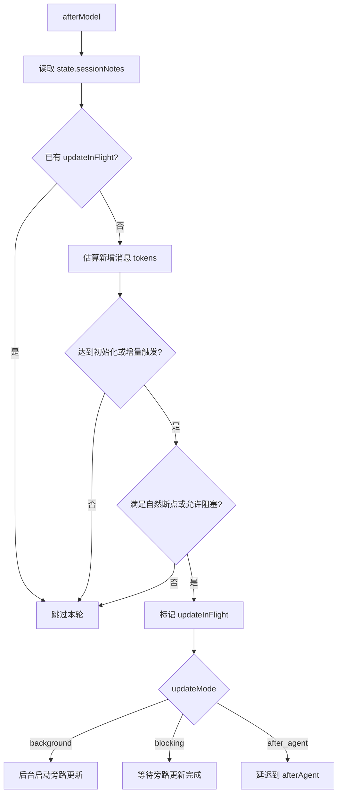
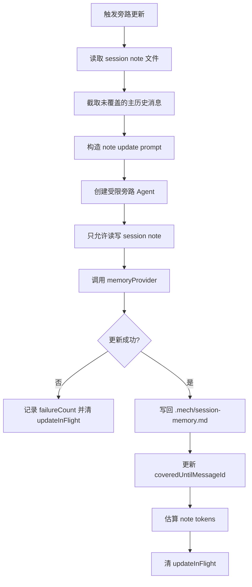
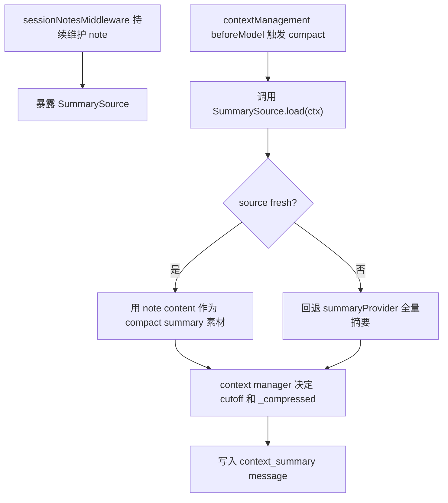

# Session Notes Middleware 设计

> 本文只描述旁路 Agent 笔记摘要中间件的目标方案，不包含实现代码。通用上下文预算管理能力独立放在 `docs/16-context-management-middleware-design.md`。

## 1. 设计目标

`sessionNotesMiddleware` 负责维护 session-scoped markdown 笔记。它通过旁路 Agent 或受限摘要流程，周期性整理当前会话的重要事实、任务状态、文件线索和错误修正。

核心目标：

- 将长会话中的高价值信息沉淀到 `.mech/session-memory.md`。
- 避免每次 compact 都从完整历史重新总结。
- 让通用上下文管理中间件可以选择读取一份 fresh session note。
- 不直接修改主 Agent 的 `state.messages`。
- 不参与工具结果预算、定期清理或 API overflow 兜底。

非目标：

- 不决定 Provider 可见消息窗口。
- 不标记 `_compressed`。
- 不处理 `context_too_long`。
- 不清理 tool result。
- 不承担跨项目长期记忆。

## 2. 与 Context Management Middleware 的边界

`sessionNotesMiddleware` 是“旁路笔记层”，`contextManagementMiddleware` 是“上下文预算层”。

| 能力                         | `sessionNotesMiddleware` | `contextManagementMiddleware` |
| ---------------------------- | ------------------------ | ----------------------------- |
| 旁路 Agent 定期更新笔记      | 是                       | 否                            |
| 写 `.mech/session-memory.md` | 是                       | 否                            |
| 暴露 SummarySource           | 是                       | 消费                          |
| 主动 full compact            | 否                       | 是                            |
| API overflow 兜底 compact    | 否                       | 是                            |
| 工具大结果 preview/store     | 否                       | 是                            |
| 定期清理旧 tool result       | 否                       | 是                            |
| 修改 `state.messages` 可见性 | 否                       | 是                            |

旁路笔记的价值是给 compact 提供更稳定、更便宜的素材，但它不应该和 compact 触发、cutoff、安全边界等逻辑耦合。

## 3. Middleware API 草案

```ts
interface SessionNotesMiddlewareOptions {
  /**
   * 旁路笔记 Provider。推荐使用便宜、长上下文、稳定遵循编辑指令的模型。
   */
  provider: LLMProvider

  /**
   * session note 写入路径。默认 .mech/session-memory.md。
   */
  path?: string

  /** 触发旁路更新的条件。 */
  trigger?: SessionNotesTrigger

  /** session note 的最大预算。 */
  maxTokens?: number

  /** 每个 section 的建议最大长度。 */
  maxSectionTokens?: number

  /** 更新模式。 */
  updateMode?: 'after_model_background' | 'after_model_blocking' | 'after_agent'

  /** 旁路 Agent 可用工具，应限制在读取/编辑 session note 的最小集合。 */
  allowedTools?: string[]

  /** session note 的章节结构。 */
  sections?: SessionNoteSection[]

  /** 自定义旁路更新 prompt。 */
  prompt?: string

  /** 失败熔断，避免每轮重复失败。 */
  failurePolicy?: {
    maxConsecutiveFailures?: number
    cooldownTurns?: number
  }
}

interface SessionNotesTrigger {
  minMessageTokensToInit?: number
  minTokensBetweenUpdates?: number
  toolCallsBetweenUpdates?: number
  minTurnsBetweenUpdates?: number
  naturalBoundary?: boolean
}

interface SessionNoteSection {
  name: string
  description: string
  maxTokens?: number
}
```

推荐默认值：

- `path` 默认 `.mech/session-memory.md`。
- `minMessageTokensToInit` 默认 `10000`。
- `minTokensBetweenUpdates` 默认 `5000`。
- `toolCallsBetweenUpdates` 默认 `3`。
- `naturalBoundary` 默认 `true`。
- `maxTokens` 默认 `12000`。
- `updateMode` 默认 `after_model_background`。
- `allowedTools` 默认只允许读写 session note。

## 4. State 设计

中间件只写入顶层 `state.sessionNotes`。

```ts
interface SessionNotesState {
  path: string
  lastUpdatedAt?: number
  lastUpdatedTurn?: number
  coveredUntilMessageId?: string
  coveredUntilMessageIndex?: number
  estimatedTokens?: number
  updateInFlight?: boolean
  failureCount: number
  lastFailureAt?: number
  lastFailureTurn?: number
}
```

状态语义：

- `coveredUntilMessageId` 表示当前 note 覆盖到哪条主历史消息。
- `estimatedTokens` 表示 session note 自身估算 token。
- `updateInFlight` 用于防止并发启动多个旁路更新。
- `failureCount` 用于熔断和 cooldown。

该中间件不写：

- `state.contextManagement`
- `_compressed`
- `_meta.kind = 'context_summary'`
- tool result storage

## 5. Session Note 结构

默认 markdown 文件结构：

```md
# Session Memory

## Current State

## Task Specification

## Files and Functions

## Decisions

## Errors & Corrections

## Key Results

## Worklog
```

章节说明：

- `Current State`：当前任务进展和下一步。
- `Task Specification`：用户目标、约束、验收标准。
- `Files and Functions`：涉及文件、函数、模块和关键路径。
- `Decisions`：已经确定的设计取舍。
- `Errors & Corrections`：遇到过的错误、原因和修正方式。
- `Key Results`：已经验证过的重要结果。
- `Worklog`：简短时间线，避免重复工作。

每次更新应优先“改写和合并”现有笔记，而不是无限追加。

## 6. 触发策略

旁路更新发生在主模型响应后，默认不阻塞用户可见输出。

触发条件：

1. session note 不存在，且当前可见历史超过 `minMessageTokensToInit`。
2. session note 已存在，且距离上次覆盖点增长超过 `minTokensBetweenUpdates`。
3. 工具调用数增长超过 `toolCallsBetweenUpdates`。
4. 如果 `naturalBoundary` 为 true，则优先在以下自然断点更新：
   - 当前 assistant turn 没有工具调用。
   - 工具调用批次已经全部完成。
   - Agent run 即将结束。

不触发条件：

- `updateInFlight` 为 true。
- 连续失败次数超过 `maxConsecutiveFailures` 且仍在 cooldown。
- 当前 run 是 session notes 自己的旁路 Agent，避免递归更新。
- 主历史消息没有明显增量。

流程图：



## 7. 旁路 Agent 更新流程

旁路更新应使用受限 Agent，而不是复用主 Agent 的完整工具集。

限制原则：

- Provider 使用 `options.provider`。
- tools 只允许读取和编辑 session note。
- system prompt 明确要求维护 markdown 笔记，不对用户输出。
- 禁止执行项目修改、shell、网络等与笔记无关的能力。
- 旁路 run 的 props 应带上 `querySource: 'session_notes'` 或类似标记，避免递归触发。

更新输入：

- 当前 session note 内容。
- 自上次覆盖点之后的主历史消息摘要输入。
- 当前 todos、cwd、关键 props 等只读环境信息。
- 工具调用结果 preview，而不是完整大结果。

更新输出：

- 覆盖写回 `.mech/session-memory.md`。
- 更新 `state.sessionNotes.coveredUntilMessageId`。
- 更新 `estimatedTokens`、`lastUpdatedAt`、`lastUpdatedTurn`。
- 清除 `updateInFlight`。

流程图：



## 8. SummarySource 输出接口

`sessionNotesMiddleware` 暴露 `source`，供 `contextManagementMiddleware` 可选读取。

```ts
interface SummarySource {
  name: string
  load(ctx: RunContext): Awaitable<SummarySourceResult | null>
}

interface SummarySourceResult {
  content: string
  coveredUntilMessageId?: string
  coveredUntilMessageIndex?: number
  estimatedTokens?: number
  fresh: boolean
  metadata?: Record<string, unknown>
}
```

fresh 判断建议：

- session note 文件存在。
- `state.sessionNotes.coveredUntilMessageId` 不为空。
- 未覆盖消息增量低于 `minTokensBetweenUpdates`。
- `estimatedTokens` 未超过 `maxTokens`。
- 最近更新没有失败。

读取规则：

- `load(ctx)` 只读取 note，不启动更新。
- 如果 note 不存在或明显过期，返回 `null` 或 `fresh: false`。
- `SummarySource` 不决定 compact cutoff。
- `SummarySource` 不标记 `_compressed`。
- `SummarySource` 不修改 `state.messages`。

## 9. 与 Context Management 的组合

推荐组合：

```ts
const sessionNotes = sessionNotesMiddleware({
  provider: memoryProvider,
  path: '.mech/session-memory.md',
})

const contextManagement = contextManagementMiddleware({
  summaryProvider,
  summary: {
    sources: [sessionNotes.source],
    sourcePolicy: 'prefer_fresh_source',
  },
})
```

组合流程：



关键边界：

- `sessionNotesMiddleware` 不知道何时 compact。
- `contextManagementMiddleware` 不知道如何更新 note。
- 两者通过 `SummarySource` 解耦。
- 没有 session notes 时，context management 仍然完整可用。
- session notes 单独启用时，只产生笔记，不改变模型上下文窗口。

## 10. 失败处理

旁路笔记失败不能影响主 Agent run。

失败策略：

- background 模式下捕获所有错误，只写入 `state.sessionNotes.failureCount`。
- blocking 模式下也不抛给主 loop，除非调用方显式配置 `throwOnFailure`。
- 连续失败超过阈值后进入 cooldown。
- 下次成功后清零 `failureCount`。
- 文件写入失败时不更新 `coveredUntilMessageId`，避免错误标记已覆盖。

## 11. 后续实现验收点

后续实现时至少验证：

- 中间件可单独启用，只更新 `state.sessionNotes`，不修改 `state.messages`。
- 达到 token 增量和工具调用条件后触发旁路更新。
- `updateInFlight` 能阻止并发重复更新。
- 旁路 Agent 不会递归触发 session notes 更新。
- session note 写入成功后更新 `coveredUntilMessageId` 和 `estimatedTokens`。
- 失败不会中断主 Agent。
- `SummarySource.load(ctx)` 能读取 fresh note。
- `contextManagementMiddleware` 可以消费 source，但两者没有硬依赖。
